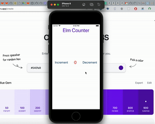

# Elm Native

Build mobile apps with elm using NativeScript API. `elm/http` works with this library as well!

We can build simple apps like counter

or something like a blog

or even complex app with page transitions, modals, dialog, and much more!

## How it works

We will use [CustomElements](https://guide.elm-lang.org/interop/custom_elements.html) feature to create mobile UI elements with nativescript objects and control the nativescript object from elm.

Here's a simple representation of how UI elements are created

`Elm` -> `Nativescript` -> `Mobile`

When we listen for / receive an event,

`Mobile` -> `Nativescript` -> `Elm`

Consider this flow while building an application. This will help you to overcome performance issues if you encounter them.

### Supported Features

- Dialog
- Page transitions animations
- Modal page
- Execution of OS specific property assignment and Native code (Be careful)
- Navigating page back and forth using frame functions
- Has bindings for all Nativescript UI elements
- Calling methods/setting attributes in the event object within elm (Will be improved in future)
- Simple and complex listviews templates and much more

More features will be added soon.

## TODO

- [ ] Write docs for attributes
- [ ] Convert raw js into rescript
- [ ] Build a starter template with elm support with bindings pre-installed
- [ ] Support animations
- [ ] Split project into different modules, publish library in elm and npm
- [ ] Use taskport to build typesafe nativescipt api calls.
